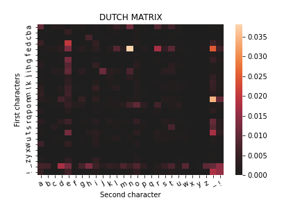

# Analyse letterfrequenties
Voor het maken van deze opdracht was aanbevolen om Hadoop te gebruiken voor de map-reduce functionaliteit. Wij hebben veel moeite gehad om Hadoop werkend te krijgen, daarom hadden we besloten om een eigen Hadoop-geïnspireerde programma te maken om in dezelfde stijl map reduce parallel uit te voeren. 

Onze mini Hadoop oftewel "[Hadopy](https://github.com/MariaDukmak/Hadopy)", is via pip te installeren.


## Algoritme trainen 
Voor het "trainen" van ons algoritme hebben we gebruik gemaakt van twee verschillende  [teksten](https://github.com/MariaDukmak/DIP/tree/main/letterfrequenties/text). 
Om de train matrixen aan te maken, run de volgende command: 

*dutch.txt*
```bash 
$ cat tekst/dutch.txt | hadopy --m "python mapper.py" --r "python reducer.py" | python matrix_saver.py dutch
```

*english.txt*
```bash 
$ cat tekst/english.txt | hadopy --m "python mapper.py" --r "python reducer.py" | python matrix_saver.py english
```

#### Interne werking
Dit is een voorbeeldje van hoe de volgende tekst omgezet zou worden tot een matrix.
```
Hello Hallo
```
→ mapper →
```
h-e     1
e-l     1
l-l     1
l-o     1
o-_     1
_-h     1
h-a     1
a-l     1
l-l     1
l-o     1
```
→ reducer →
```
a-l     1
e-l     1
_-h     1
h-a     1
h-e     1
l-l     2
l-o     2
o-_     1
```
→ matrix maker → 

|   | **a** | **e** | **h** | **l** | **o** | **_** |
| :------------: | :------------: | :------------: | :------------: | :------------: | :------------: | :------------: |
| **a** | 0 | 0 | 1 | 0 | 0 | 0 |
| **e** | 0 | 0 | 1 | 0 | 0 | 0 |
| **h** | 0 | 0 | 0 | 0 | 0 | 1 |
| **l**| 1 | 1 | 0 | 2 | 0 | 0 |
| **o** | 0 | 0 | 0 | 2 | 0 | 0 |
| **_** | 0 | 0 | 0 | 0 | 1 | 0 |

## Classificeren
Voor het testen van het algoritme maken we gebruik van [deze](https://github.com/MariaDukmak/DIP/blob/main/letterfrequenties/text/sentences.nl-en.txt) tekst.
#### Resultaat:
```
dutch   73
english 118
```

We hebben ervoor gekozen om lege regels niet te classificeren en daarom is er eentje minder geteld.  
Verder komen deze resultaten heel erg overeen met:
> Je code werkt goed als er 73 Nederlandstalige en 119 Engelstalige regels worden herkend.

### Interne werking
Dit is een voorbeeldje van hoe de volgende tekst geclassificeerd zou worden regel voor regel.
```
This is an english sentence.
This is an english sentence.
Dit is een nederlandse zin.
This is an english sentence.
```
→ mapper →  
(engels-nederlands)
```
1-0
1-0
0-1
1-0
```
→ reducer →
```
3-1
```

## Resultaten reproduceren
Installeer de vereiste libraries:   
`$ pip install -r requirements.txt`

__Met hadopy__

```bash 
$ cat tekst/sentences.nl-en.txt | hadopy --m "python mapper.py" --r "python reducer.py" | python classifier.py | python classifier_shower.py
```

__Zonder hadopy__ (Geadviseerd voor windows machines)

```bash 
$ cat tekst/sentences.nl-en.txt | python mapper.py | sort | python reducer.py | python classifier.py | python classifier_shower.py
```

## Extra
We vonden het ook nog interresant om de getrainde matrixen te visualizeren als heatmaps, 
om te kijken of daar goed aan te zien is wat het verschil tussen de talen zijn.


Hier zien we dat de meeste voorkomende letters combinatie is "en", dat betekent dat veel Nederlandse woorden beginnen en/of eindigen met deze twee letters. 


Hier zien we dat in de twee matrices best een verschil zit. Het grootste verschil ligt hier juist bij dat een Engelse woord meestal met een "e " eindigt. 
