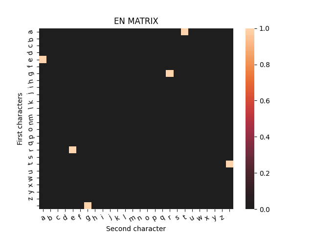
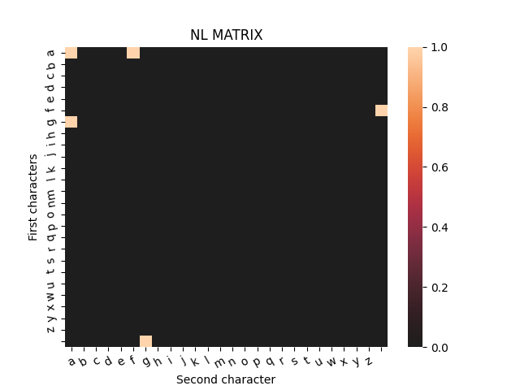

# Opdracht 3: Paxos-implementatie
In deze opdracht moeten wij het Paxos algoritme implementeren. Ook voegen we later een uitbreiding[Fase 2] toe waarin we een deel van de vorige opdracht toevoegen aan het algoritme.

## Fase 1
In fase 1 van de opdracht hebben we het paxos algoritme geïmplementeerd. Om te laten zien dat onze code werkt hebben we 2 voorbeelden van canvas gehaald.  
Als je het wilt testen/reproduceren kan je de unit-tests in `canvas_examples.py` uitvoeren.

## Fase 2
In fase 2 hebben we het algoritme uitgebreid met een Learner. Hiermee hebben we een gedeelte van de Letterfrequenties-opdracht toe kunnen voegen. Hieruit zijn een paar matrixen gekomen.

In deze matrices is te zien dat elke lettercombinatie succesvol door het algoritme is gekomen:

We kwamen er achter dat de voorbeeld uitkomsten op canvas niet zo nauwkeurig zijn en bij fase 2 was er al helemaal geen, dus onze unittest aanpak werd daardoor wel moeilijker.
Het zou dus kunnen dat de unittests net anders zijn dan bedoeld. Maar het zijn wel onze inschattingen van wat het zou moeten zijn.